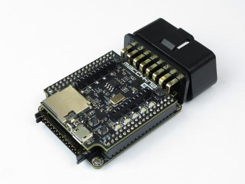

# Macchina M2

The Macchina M2 is a open-source, programmable interface with hardware support for most automotive protocols including CAN, SWCAN, LIN, J1850PWM, ISO9141, and KWP2000.

The under-the-dash model, pictured above, plugs into your car's OBD2 port.  The Macchina M2 is also available in an under-the-hood model.

To order visit https://www.macchina.cc/catalog